#### 本项目提供的功能有 相机滤镜，动态贴纸，自定义效果，加载3D模型等

#### 声明：上层按钮是贴纸，动画等功能，下层按钮是对整个画面做滤镜效果。部分效果取自[SharkMusic](https://github.com/shark-dynamics/shark-music-visualizer-android)。

#### 1.动态贴纸
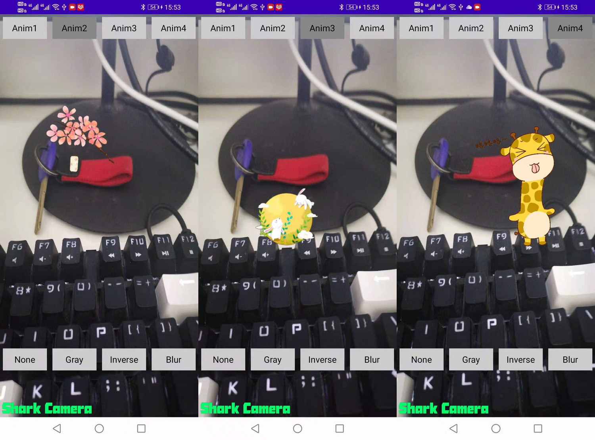

#### 2.沿贝塞尔曲线运动的动画，途中的黄色蝴蝶
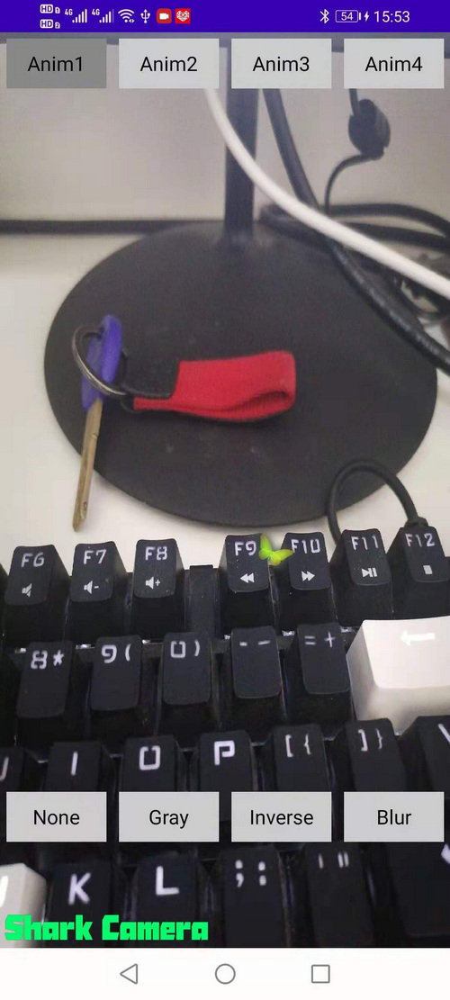

#### 3.自定义动画，下雪与落花。其实是粒子效果
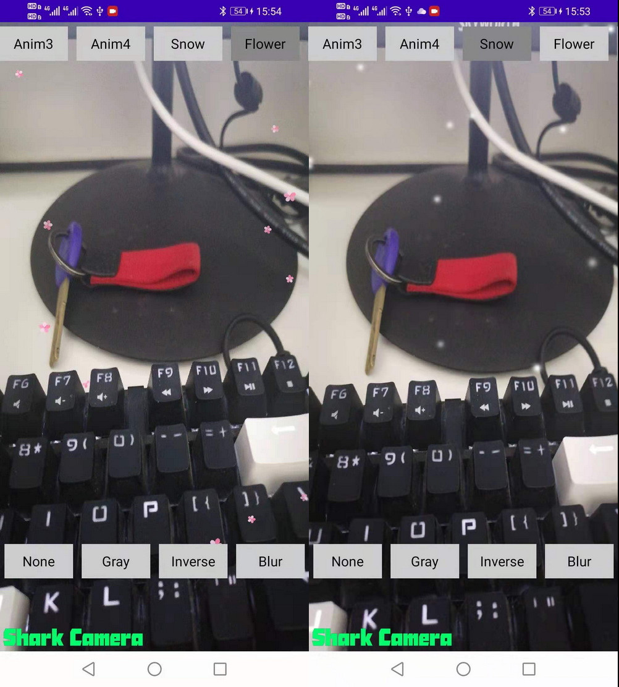

#### 4.加载3D模型
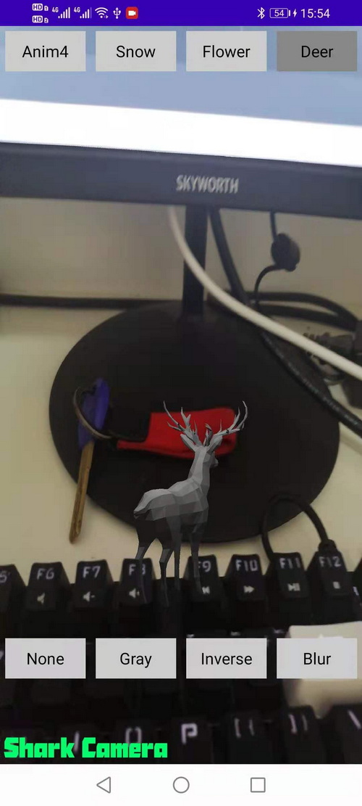

#### 5.灰色
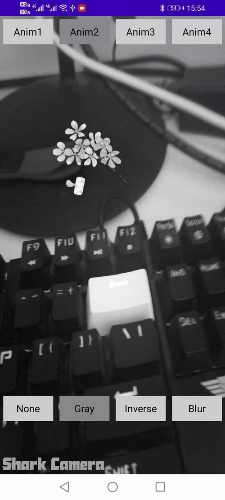

#### 6.反转
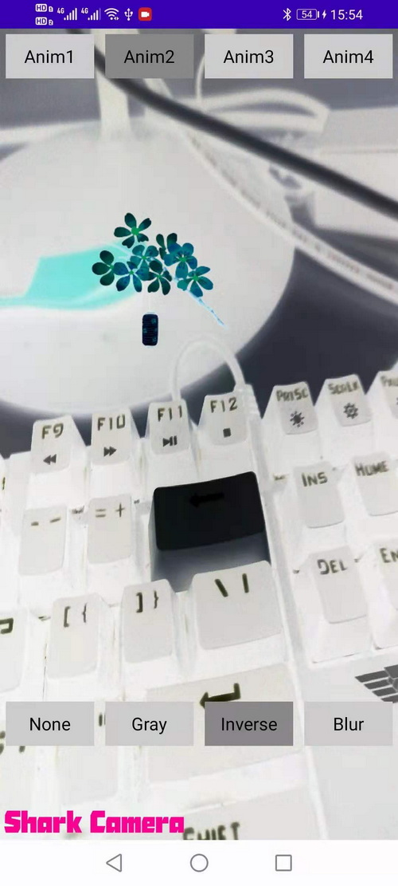

#### 7.模糊
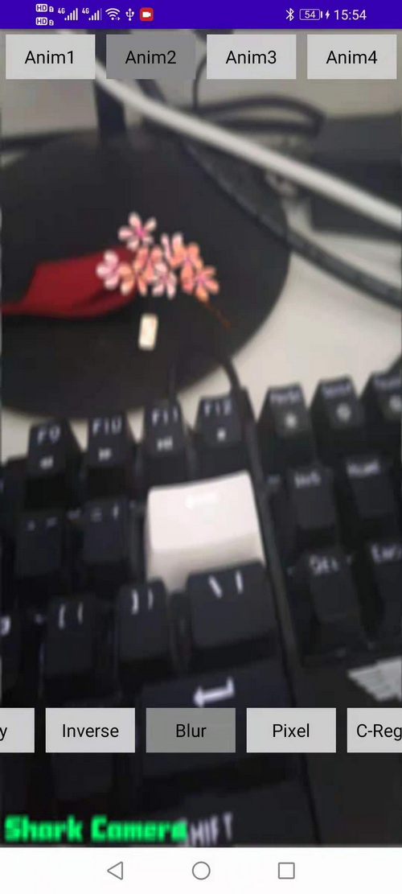

#### 8.像素化
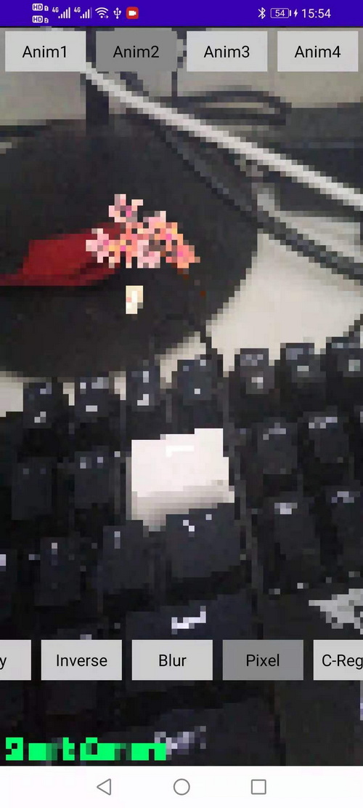

#### 9.颜色块
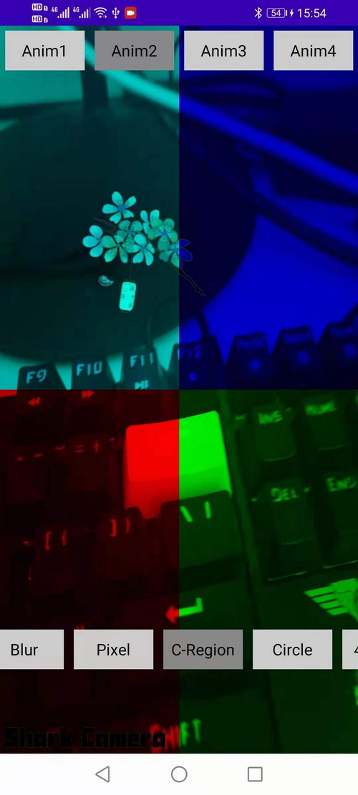

#### 10.圆形
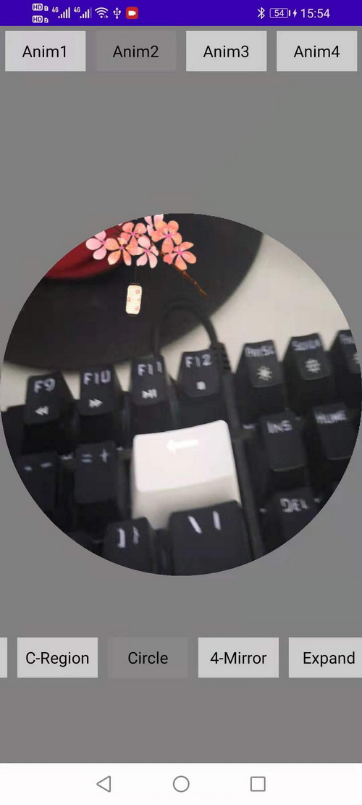

#### 11.镜像
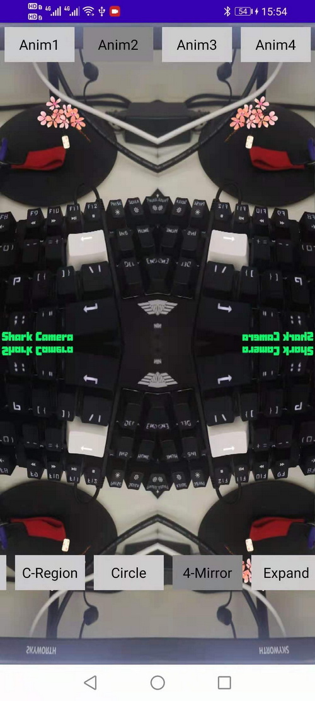

#### 12.扩大
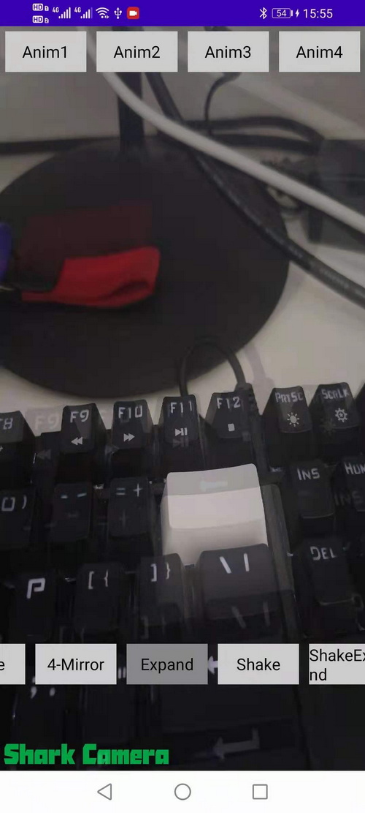

#### 13.抖动
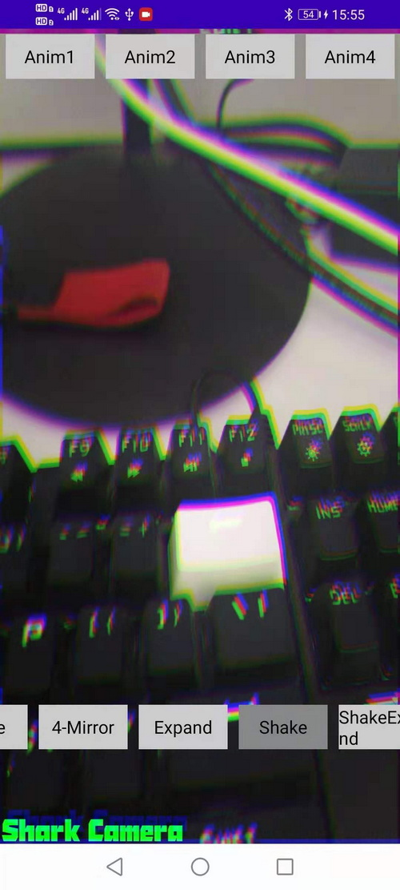

#### 14. 叠加
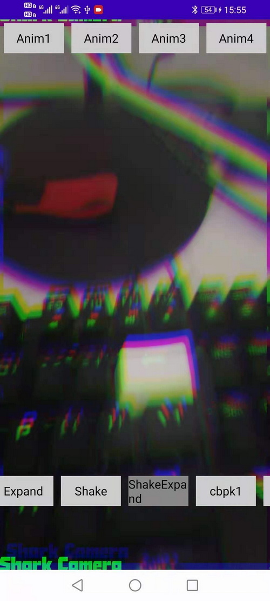

#### 15.故障
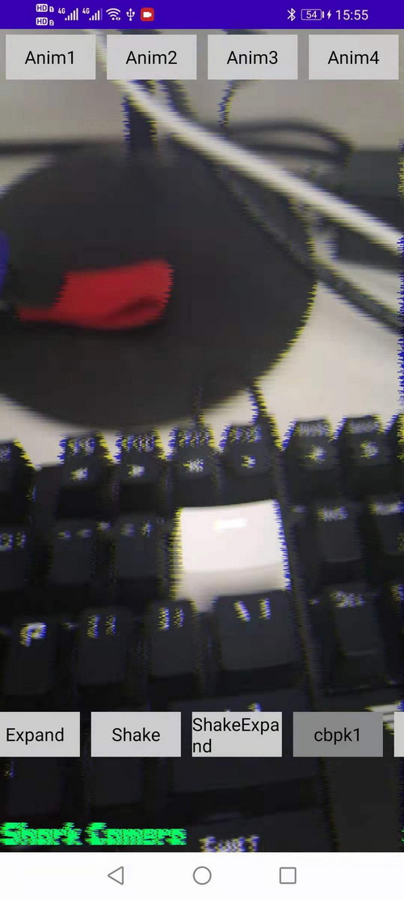

#### 16.故障
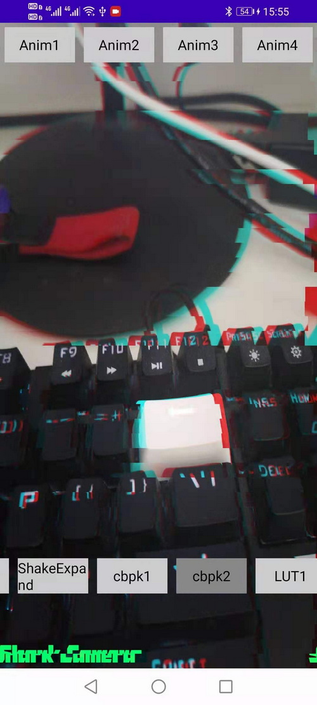

#### 17. lut
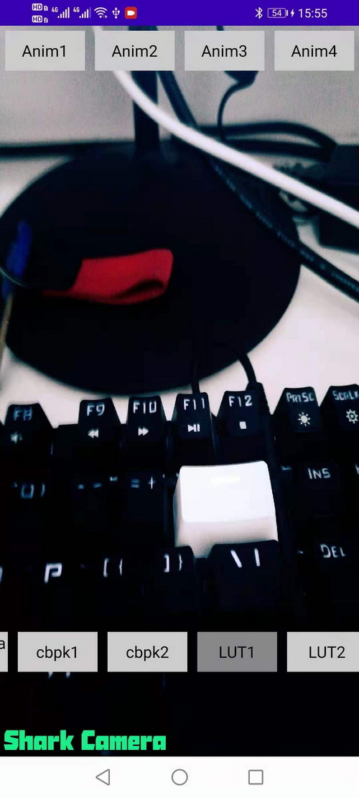

#### 18. lut
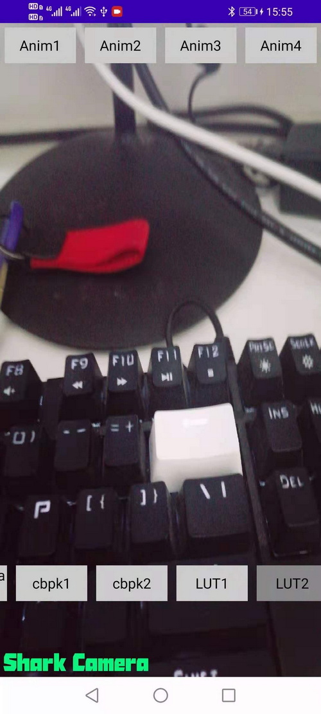

### Oh...